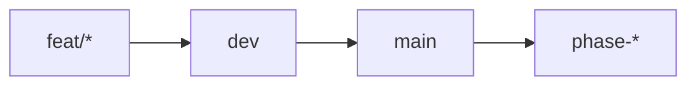
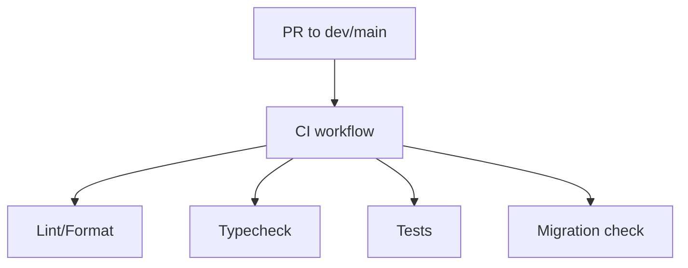
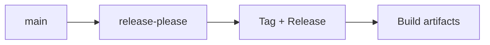
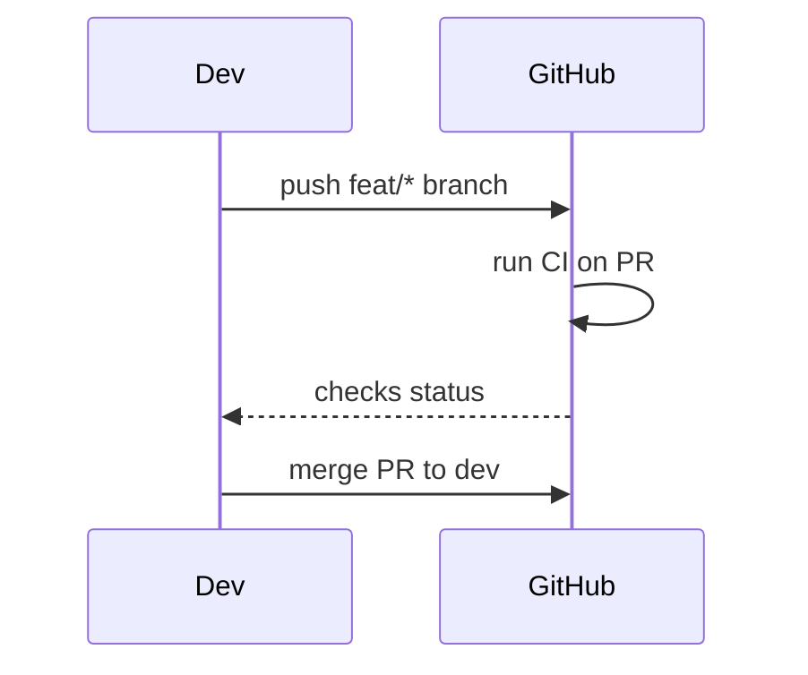

# Git & GitHub Guide (Rules, Branches, Workflows, CI/CD, Use Cases)

This document focuses exclusively on how Git and GitHub are used in this repository, including branch rules, workflows, CI/CD, and contributor use cases.

---

## 1. Branching Rules & Strategy

### Core Branches

- **`main`**: production/release branch. Protected and used for releases.
- **`dev`**: integration branch. Feature branches merge here first.
- **`phase-*`**: immutable snapshot branches used for auditability and milestone tracking.
- **`feat/*`**: short-lived feature branches used for daily development.



### Summary of Rules

| Branch Type | Purpose | Protection | Lifecycle |
| --- | --- | --- | --- |
| `feat/*` | Feature work | No strict protection | Deleted after merge |
| `dev` | Integration | CI checks required | Long-lived |
| `main` | Release | Strict CI + release flow | Long-lived |
| `phase-*` | Audit snapshot | Protected, immutable | Permanent |

---

## 2. GitHub Workflows (CI/CD)

The repository uses GitHub Actions workflows under `.github/workflows/`.

### 2.1 Continuous Integration (CI)

- **Workflow**: `ci.yml`
- **Triggers**: pushes to `main`/`dev`, PRs to `main`/`dev`, manual runs
- **Jobs**:
  - Lint & format (ruff)
  - Type check (mypy + pyright)
  - Tests (pytest with pgvector Postgres service)
  - Migration check (alembic)



### 2.2 Schema Validation

- **Workflow**: `schema-validation.yml`
- **Triggers**: changes to migrations or model files
- **Purpose**: detect schema drift, ensure one migration head, test downgrade/upgrade cycle.

### 2.3 Phase Snapshots

- **Workflow**: `phase-snapshot.yml`
- **Triggers**: push to `phase-*`
- **Purpose**: run full validation, create audit reports, tag snapshot.

### 2.4 Dependency Security

- **Workflow**: `dependency-check.yml`
- **Triggers**: weekly schedule + manual
- **Purpose**: run `pip-audit`, upload SARIF, optionally fail on vulnerabilities.

### 2.5 Release Automation

- **Workflow**: `cd-release.yml`
- **Triggers**: push to `main`
- **Purpose**: run release-please, generate tags/releases, build artifacts.



---

## 3. GitHub Governance Files

- **PR Template**: `.github/PULL_REQUEST_TEMPLATE.md` defines checklists for quality, testing, and migrations.
- **CODEOWNERS**: `.github/CODEOWNERS` ensures reviewers are requested for core paths.
- **Dependabot**: `.github/dependabot.yml` defines dependency update automation.

---

## 4. Contributor Use Cases

### 4.1 Feature Development (Daily Flow)

1. Create a feature branch from `dev`.
2. Implement changes and run local checks.
3. Open a PR to `dev`.
4. CI runs automatically; fix any failures.
5. Merge to `dev` (feature branch deleted).



### 4.2 Release Flow

1. Create PR from `dev` → `main` when integration is stable.
2. CI must pass on the PR.
3. Merge to `main` triggers release-please.
4. If a release is created, artifacts are built and attached to the GitHub Release.

### 4.3 Phase Snapshot Flow

1. Create `phase-N` branch from `main` after release is complete.
2. Push triggers `phase-snapshot.yml`.
3. Audit metadata + tagged snapshot are created.

---

## 5. CI/CD Expectations

- **Local checks recommended before PR**: ruff, mypy, pyright, pytest.
- **All CI jobs must pass** before merge to protected branches.
- **Phase branches are immutable**, serving as audit logs for milestones.

---

## 6. Practical Quick-Reference Commands

```bash
# Create feature branch
git checkout dev
git pull origin dev
git checkout -b feat/my-feature

# Push branch and open PR
git push origin feat/my-feature

# Check CI workflow status
gh pr checks <PR_NUMBER>

# Merge PR after checks
gh pr merge <PR_NUMBER> --squash --delete-branch
```

---

*End of Git & GitHub guide.*
