# ForecastLabAI Architecture Diagrams

This document provides diagram-first views of the repository's logic, workflows, stack, APIs, architecture, and reusable patterns. The diagrams are grounded in the inspected code under `app/`, `frontend/src/`, `docker-compose.yml`, and the base docs.

## 1. System context

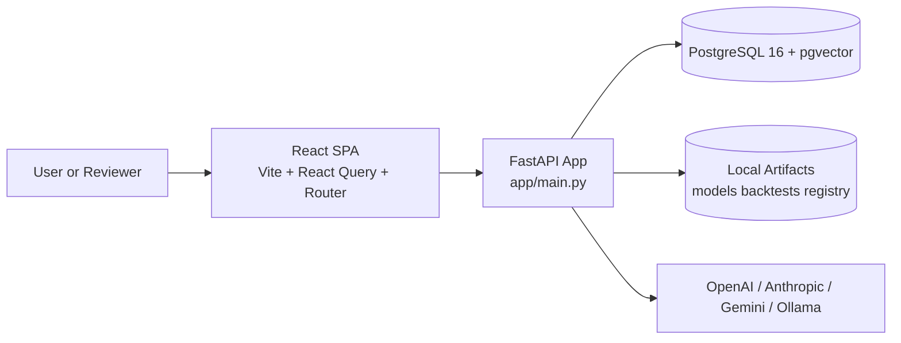

## 2. Backend slice map

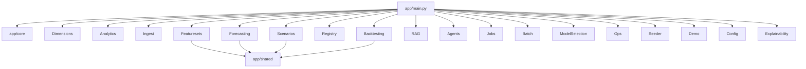

## 3. Request handling pattern

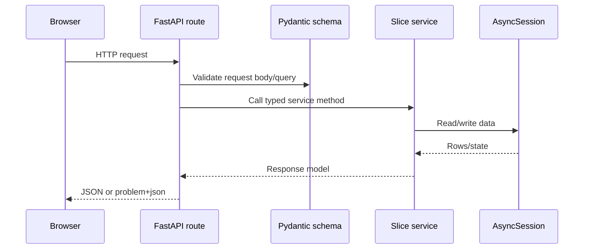

## 4. Retail data model

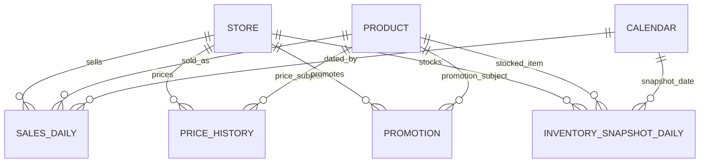

## 5. Forecast training flow

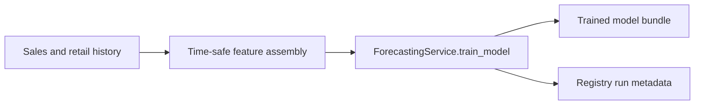

## 6. Prediction and planning flow

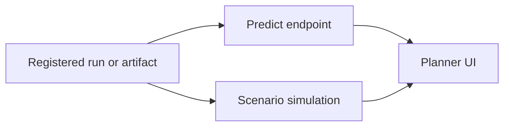

## 7. Backtesting and champion selection

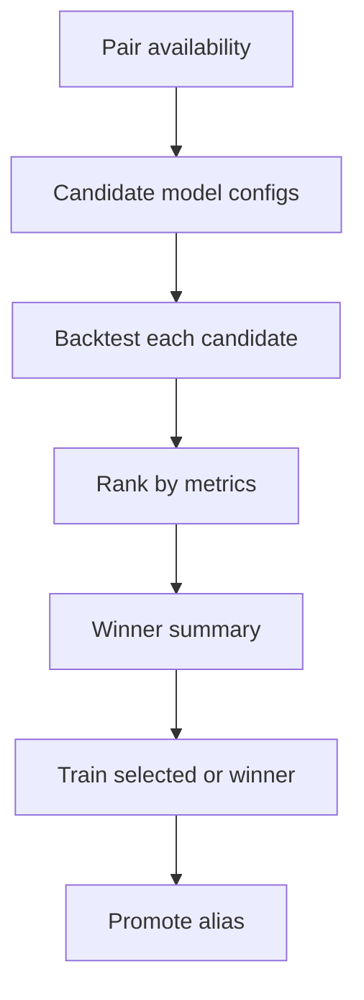

## 8. Registry and artifact governance

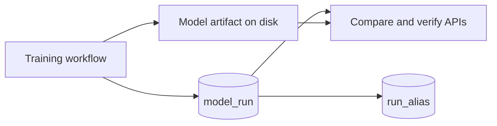

## 9. RAG indexing workflow

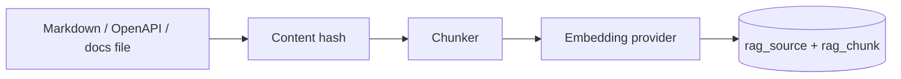

## 10. RAG retrieval workflow

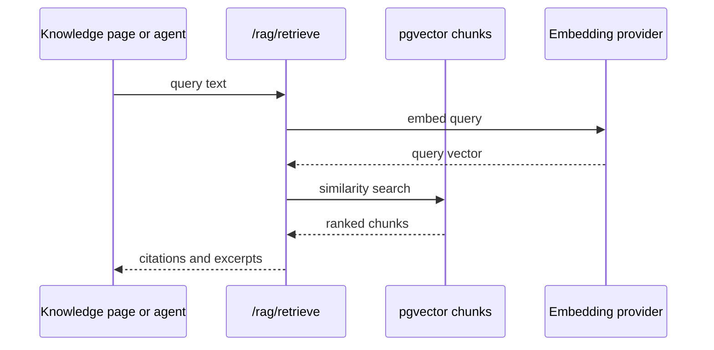

## 11. Agent chat and approval flow

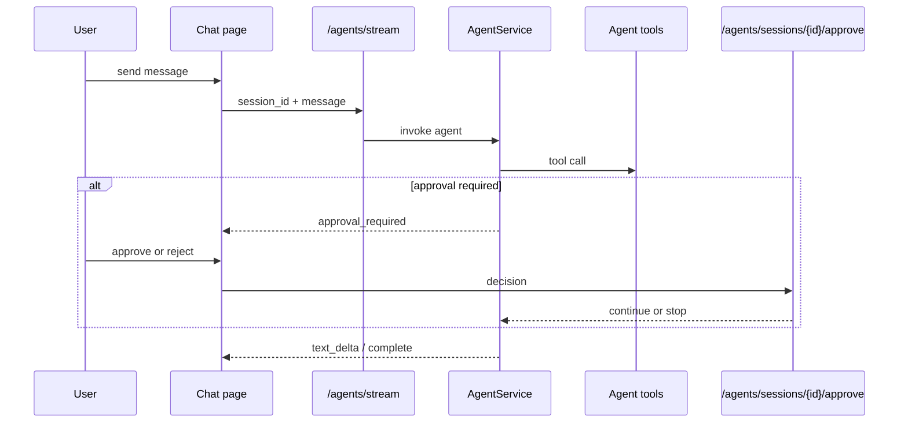

## 12. Demo pipeline orchestration

```mermaid
flowchart LR
    Start[Showcase or make demo]
    Seed[Seeder]
    Features[Featuresets]
    Train[Train models]
    Backtest[Backtest]
    Register[Register winner]
    Alias[Create alias]
    Knowledge[RAG probe]
    Agent[Agent probe]
    Finish[Summary]

    Start --> Seed
    Seed --> Features
    Features --> Train
    Train --> Backtest
    Backtest --> Register
    Register --> Alias
    Alias --> Knowledge
    Knowledge --> Agent
    Agent --> Finish
```

## 13. Frontend route topology

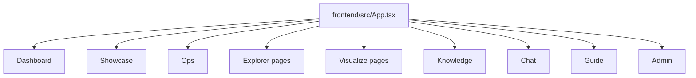

## 14. Frontend data-flow pattern

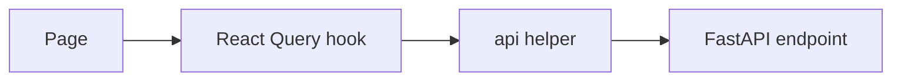

## 15. Runtime deployment topology

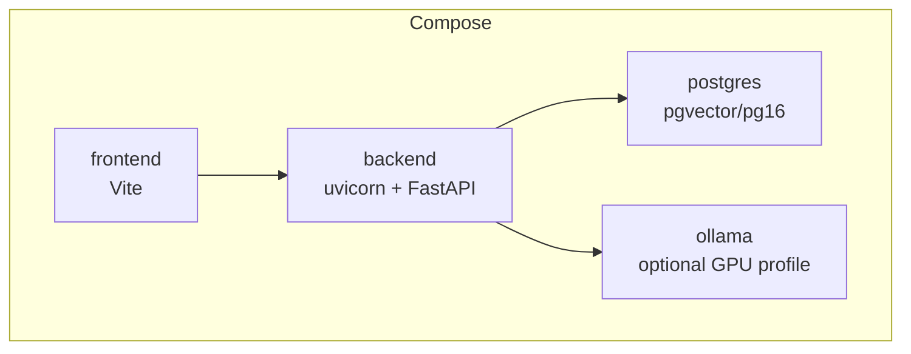

## 16. CI/CD flow

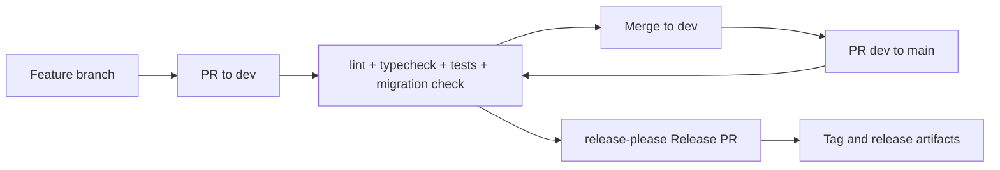

## 17. Reusable architectural patterns

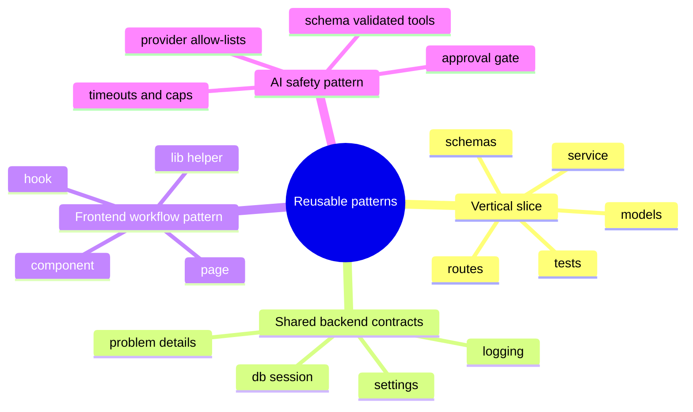
