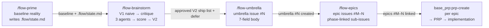

<!-- provenance: reverse-engineered from
  /home/w7-hector/_KB-BASE-BY-w7/JOB/DIA-FLOW/ai_engineering_mermaid_flow_pack/docs/flow-analysis/
    01-decomposition.md        — umbrella 7-field contract, epic phases, hierarchy-as-data
    02-execution-pipeline.md   — issue → 5-subtask pipeline (handed off to issue-to-subtasks)
    03-continuation-discipline.md — baseline → V1 → 3-agent research → score → V2
  + context-engineering-intro-main/use-cases/build-with-agent-team
  Working analysis: .flow/state.md + .flow/brainstorm-log.md (ForecastLabAI, 2026-06-01).
  ForecastLabAI project decisions recorded in GitHub umbrella #368, epic #369. -->

# flow-pack methodology

> Turn "what should we do next?" into a dependency-aware, parallel-friendly, release-gated
> GitHub hierarchy — one pipeline from baseline reality to executable epics ready for PRPs.

## Pipeline overview



**Research fan-out inside `/flow-brainstorm`** (not shown above to keep diagram readable): after
the critique gate, exactly 3 read-only subagents run in parallel — Agent A (Known Issues),
Agent B (Best Practices), Agent C (Dependencies) — then synthesize into the score table.

---

## Stage 1 — Plan

### /flow-prime — baseline reality

1. Delegates to `core_piv_loop:prime` for codebase priming (never re-implements it).
2. Gathers GitHub state: open issues, milestones, labels, open PRs, recent releases.
3. Maps the current workflow: `.claude/commands/`, `.claude/rules/`, `.github/workflows/`.
4. Synthesizes a **current-workflow-map** (installed commands, rules, CI workflows, hooks) and a
   **you-are-here snapshot** (branch, version, open issues, milestone, flow-namespace gap).
5. Writes or updates `.flow/state.md` with both sections.
6. Prints gate result and next-command pointer: `→ Next: /flow-brainstorm`.

### /flow-brainstorm — V1 → score → V2

1. Produces **V1** — a flat bullet list of 5–10 candidate items, from baseline alone, unscored,
   labeled "V1" explicitly.
2. Applies the **critique gate**: tags each item with zero or more flags
   `{assumption, scope-creep, no-evidence}`. Does not fix V1; labels it for research.
3. Spawns **exactly 3 read-only research subagents** in parallel:

   | Agent | Mandate |
   |-------|---------|
   | A — Known Issues | Open bugs, prior incidents relevant to V1 items |
   | B — Best Practices | Current docs, SDK, framework changes |
   | C — Dependencies | Upstream changes, blockers, API availability |

4. **Scores** every V1 item on 5 dimensions (1–10 each, max 50):

   | Dimension | What it captures |
   |-----------|-----------------|
   | Value | Outcome impact for users / stakeholders |
   | Risk | Probability of failure or rework |
   | Readiness | Upstreams done; decisions made |
   | Complexity | Size of the work chunk |
   | Evidence | Grounding in research agent reports |

5. Applies **score-band rule**:
   - **≥ 40** → V2 ship list
   - **< 36** → defer list (each item carries an explicit one-clause reason)
   - **36–39** → negotiation zone; surfaces to human before any GitHub write

6. Prints a `X/10` one-pass confidence score for the V2 ship list.
7. Waits for explicit human approval gate before any GitHub write.
8. Hands off to `/flow-umbrella`.

---

## Stage 2 — Decompose

### /flow-umbrella — umbrella issue

1. Creates the umbrella GitHub issue with the **7-field body contract** (see § Umbrella contract).
2. Attaches labels `umbrella` + `flow` and the project milestone.
3. Dry-run echoes the issue body; waits for approval before writing.
4. Prints gate + next-command pointer: `→ Next: /flow-epics`.

### /flow-epics — epic issues

1. Creates N epic issues (one per V2 ship item), phase-annotated
   (Foundation / Parallel after Foundation / Release gate).
2. Links each epic as a sub-issue of the umbrella via the REST API
   (`gh api repos/{owner}/{repo}/issues/{umbrella_id}/sub_issues -X POST -F sub_issue_id={epic_id}`).
   No native `gh` sub-issue command — always `gh api` directly.
3. Dry-run echo + idempotent check + ~1 s rate-delay per write (GitHub API courtesy).
4. Hands off to `base_prp:prp-create` per epic.

---

## Stage 3 — Execute (delegated)

> Execution is fully handled by existing tools. The flow: suite stops at epic creation.

| Epic-level work | Tool |
|-----------------|------|
| Write a PRP for the epic | `base_prp:prp-create` |
| Execute the PRP | `base_prp:prp-execute` |
| Decompose an epic into 5 subtasks | `issue-to-subtasks` skill |
| Session continuity across contexts | `writing-session-handoffs` / `HANDOFF.md` |
| Validate rule adherence | `audit-rules-drift` skill |

---

## Invariants

Every flow: command and every agent enforce these; violations must be flagged, not silently
bypassed:

1. **Read-only until approval.** No GitHub write (issue create, label, sub-issue link) before an
   explicit human "approve." Dry-run echo always precedes write.
2. **Hierarchy as data.** Every parent/child link is materialized via the REST sub-issue endpoint,
   not just mentioned in body text. Closure rolls up natively; project board grouping is automatic.
3. **Exactly 3 research agents.** /flow-brainstorm always spawns Known Issues + Best Practices +
   Dependencies. Never fewer (shallow research); never more (bloated). Additional domain agents are
   allowed on top when a critique flag demands a specialist, but the 3 baseline mandates stay.
4. **Score bands are hard.** ≥ 40 ships, < 36 defers (with written reason), 36–39 goes to human.
   No item ships without a complete 5-dimension row.
5. **7-field umbrella.** Every umbrella issue body must contain all 7 sections (Summary, Approach,
   Decomposition, Out of scope, Success criteria, Risks, Tracking). Missing fields = not done.
6. **Foundation → Parallel → Release gate.** Exactly one Foundation epic (blocks all); N parallel
   epics (feed release); exactly one Release-gate epic (closes only after Foundation + Parallel).
7. **Every defer has a reason.** A defer item with no written reason is a process failure.
8. **V1 is transient.** V1, the 3 agent reports, and the score table are working-state artifacts
   (`.flow/`). Only V2 (the umbrella body) and the defer list survive as durable records.

---

## Umbrella contract (7-field body)

Required sections in every umbrella issue body (verified against live umbrella `#55` in
`w7-mgfcode/w7-base`, the reference project):

| Field | Content |
|-------|---------|
| **Summary** | What's wrong with the current state, one paragraph |
| **Approach** | The architectural delta, one paragraph (no router / zero new runtime deps / etc.) |
| **Decomposition** | Bulleted epic list with `#N` refs + phase markers (Foundation / Parallel / Release gate) |
| **Out of scope (explicit)** | Items NOT closing this umbrella; each has a `#N` ref or a one-sentence reason it isn't tracked |
| **Success criteria** | Checkbox list (`- [ ]`) an outside reviewer can use as the close-or-not decision |
| **Risks** | Table with one mitigation per row |
| **Tracking** | Links to the project board, plan file, source-of-truth contract, and a `X/10` one-pass confidence score |

---

## Epic contract

Each epic issue body must contain:

- Opening blockquote: `Sub-issue of #N (umbrella: <title>)` + phase declaration
  (`Foundation — blocks epics #M, #M+1 …` / `Parallel after Foundation` / `Release gate`).
- `## Purpose` — what this delivery surface gives the user.
- `## Sub-tasks` — bulleted list with `#N` references to child sub-issues.
- Labels ⊇ umbrella label set (plus the `epic` label).

---

## Hierarchy-as-data (REST API)

```bash
# Link an epic under the umbrella
gh api repos/{owner}/{repo}/issues/{umbrella_id}/sub_issues \
  -X POST -F sub_issue_id={epic_id} \
  --header "GitHub-Next-Preview: true"

# Read sub-issues (GraphQL)
gh api graphql -f query='
  { repository(owner:"{owner}", name:"{repo}") {
      issue(number: {umbrella_id}) {
        subIssues(first: 20) { nodes { number title state } }
      }
  } }'
```

There is **no native `gh` sub-issue command** (cli/cli#10298). Always use `gh api` directly.
No GitHub CLI extension required.

---

## FLAI mapping table

Mapping from flow-pack methodology stages to ForecastLabAI-specific commands, skills, and tools.

| Methodology stage (KB source) | flow: command | Delegated to / reuses |
|-------------------------------|---------------|----------------------|
| Baseline reality (03) | `/flow-prime` | `core_piv_loop:prime` (codebase), `gh` CLI (GitHub state) |
| V1 naive plan (03) | `/flow-brainstorm` | — (authored by Claude from baseline) |
| 3 read-only research agents (03) | `/flow-brainstorm` | plain subagents via Agent tool |
| Score + rerank (03) | `/flow-brainstorm` | — (5-dim table, bands ≥40/<36) |
| Human V2 approval (03) | `/flow-brainstorm` | — (explicit gate before GitHub write) |
| Umbrella issue creation (01) | `/flow-umbrella` | `gh issue create` |
| Epic creation + linking (01) | `/flow-epics` | `gh issue create` + `gh api` sub-issues |
| Sub-issue decomposition (02) | — (delegate) | `issue-to-subtasks` skill |
| PRP creation per epic | — (delegate) | `base_prp:prp-create` |
| PRP execution | — (delegate) | `base_prp:prp-execute` |
| Session continuity | `/flow-prime` | `writing-session-handoffs`, `HANDOFF.md` |
| Rules audit | `/flow-prime` | `audit-rules-drift` |

---

## Durable-source split

`.claude/` is gitignored in ForecastLabAI (see `CLAUDE.md` → Learnings). Any file placed only
in `.claude/` is lost on a fresh clone and cannot be the source of truth.

| Layer | Location | Committed? | Purpose |
|-------|----------|------------|---------|
| Durable contract | `docs/flow-pack-methodology.md` | ✅ tracked | Narrative, invariants, API contract |
| Durable command templates | `docs/flow-pack/commands/*.md` | ✅ tracked | Source of truth for each command |
| Local runtime install | `.claude/commands/flow/*.md` | ❌ gitignored | Used by Claude Code slash-commands |
| Local agent rule | `.claude/rules/umbrella-issue.md` | ❌ gitignored | Agent contract during a session |

**Invariant:** the local install is a faithful byte-copy of the tracked template. If they drift,
the tracked template wins. Recovery = `cp` (see § Fresh-clone recovery).

---

## Fresh-clone recovery

After a fresh clone (or after `.claude/` is wiped), regenerate the local install from the tracked
source:

```bash
# Regenerate command(s) from tracked templates
mkdir -p .claude/commands/flow
cp docs/flow-pack/commands/*.md .claude/commands/flow/

# Verify no drift
diff docs/flow-pack/commands/flow-prime.md .claude/commands/flow/flow-prime.md \
  && echo "OK — no drift"

# The umbrella-issue.md rule has no tracked template file (the durable content lives
# in this methodology doc, § Umbrella contract). Write a fresh copy from that section
# to .claude/rules/umbrella-issue.md when needed.
```

---

## Portability manifest

To reuse the flow: suite in another repository, change these named parameters:

| Parameter | ForecastLabAI value | What to change |
|-----------|--------------------|--------------------|
| `owner/repo` | `w7-mgfcode/ForecastLabAI` | Your GitHub org/repo |
| PRP hand-off command | `base_prp:prp-create` | Your equivalent PRP/issue command |
| Codebase prime command | `core_piv_loop:prime` | Your codebase prime command or equivalent |
| Label set | `umbrella`, `epic`, `flow` | Must be created in the target repo first |
| Command namespace | `flow` (`.claude/commands/flow/`) | Any namespace not already in use |
| Docs root | `docs/flow-pack/` | Wherever you track command templates |
| Working state dir | `.flow/` | Any local-only dir added to `.gitignore` |
| Milestone name | project-specific | Your target project's milestone |

Nothing in the flow-pack commands is ForecastLabAI-specific except the `owner/repo` value and the
references to `base_prp:prp-create` and `core_piv_loop:prime`. Swap those two and it runs
anywhere.
