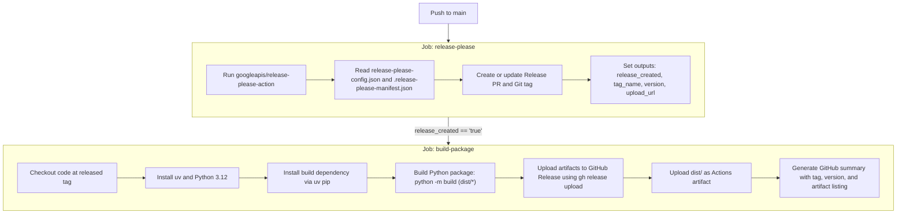

# CD Release - Flow Diagram

Flow diagram for CD Release workflow.

```mermaid
flowchart TD
  TriggerMain["Push to main"] --> ReleaseJob

  subgraph ReleaseJob["Job: release-please"]
    R1["Run googleapis/release-please-action"] --> R2["Read release-please-config.json and .release-please-manifest.json"]
    R2 --> R3["Create or update Release PR and Git tag"]
    R3 --> R4["Set outputs: release_created, tag_name, version, upload_url"]
  end

  ReleaseJob -->|release_created == 'true'| BuildJob

  subgraph BuildJob["Job: build-package"]
    B1["Checkout code at released tag"] --> B2["Install uv and Python 3.12"]
    B2 --> B3["Install build dependency via uv pip"]
    B3 --> B4["Build Python package: python -m build (dist/*)"]
    B4 --> B5["Upload artifacts to GitHub Release using gh release upload"]
    B5 --> B6["Upload dist/ as Actions artifact"]
    B6 --> B7["Generate GitHub summary with tag, version, and artifact listing"]
  end
```

## Related Files

- `.github/workflows/cd-release.yml`
- `release-please-config.json`
- `.release-please-manifest.json`
