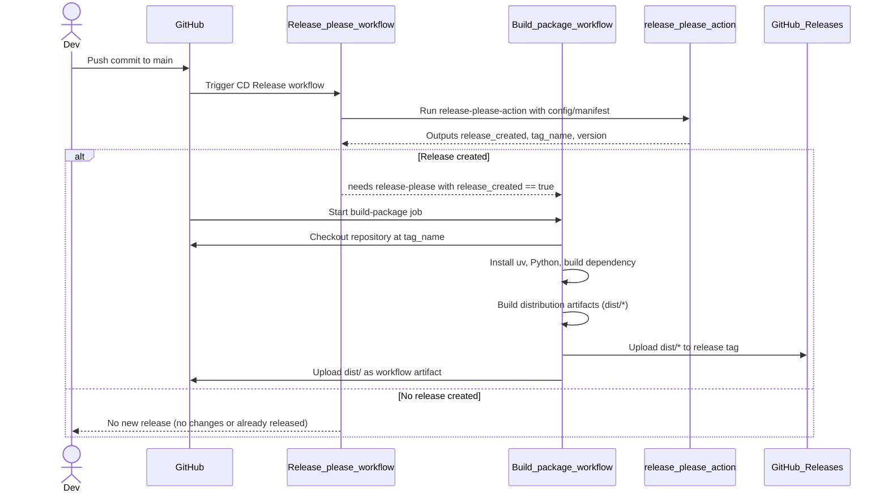

# CD Release - Sequence Diagram

Sequence diagram for CD release creation and packaging.

## Related Files

- `.github/workflows/cd-release.yml`
- `release-please-config.json`
- `.release-please-manifest.json`
