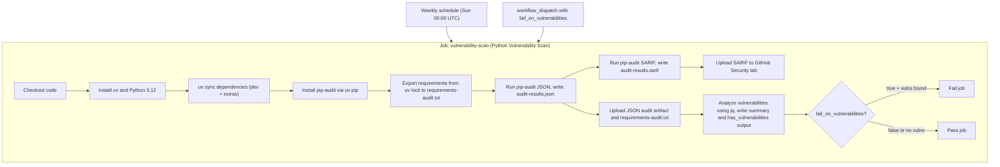

# Dependency Security Check - Flow Diagram

Flow diagram for Dependency Security Check workflow.

```mermaid
flowchart TD
  TriggerCron["Weekly schedule (Sun 00:00 UTC)"] --> ScanJob
  TriggerManual["workflow_dispatch with fail_on_vulnerabilities"] --> ScanJob

  subgraph ScanJob["Job: vulnerability-scan (Python Vulnerability Scan)"]
    D1["Checkout code"] --> D2["Install uv and Python 3.12"]
    D2 --> D3["uv sync dependencies (dev + extras)"]
    D3 --> D4["Install pip-audit via uv pip"]

    D4 --> D5["Export requirements from uv lock to requirements-audit.txt"]
    D5 --> D6["Run pip-audit JSON, write audit-results.json"]
    D6 --> D7["Run pip-audit SARIF, write audit-results.sarif"]

    D7 --> D8["Upload SARIF to GitHub Security tab"]
    D6 --> D9["Upload JSON audit artifact and requirements-audit.txt"]

    D9 --> D10["Analyze vulnerabilities using jq, write summary and has_vulnerabilities output"]
    D10 --> D11{"fail_on_vulnerabilities?"}
    D11 -->|true + vulns found| D12["Fail job"]
    D11 -->|false or no vulns| D13["Pass job"]
  end
```

## Related Files

- `.github/workflows/dependency-check.yml`
