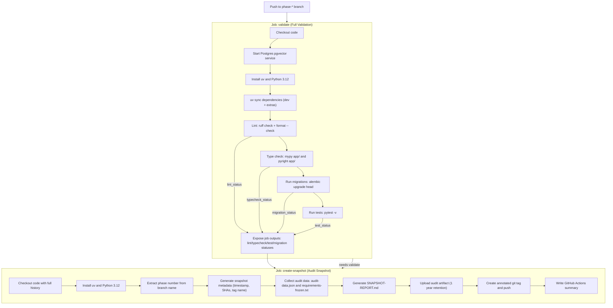

# Phase Snapshot - Flow Diagram

Flow diagram for Phase Snapshot workflow jobs.

```mermaid
flowchart TD
  Trigger["Push to phase-* branch"] --> ValidateJob

  subgraph ValidateJob["Job: validate (Full Validation)"]
    V1["Checkout code"] --> V2["Start Postgres pgvector service"]
    V2 --> V3["Install uv and Python 3.12"]
    V3 --> V4["uv sync dependencies (dev + extras)"]
    V4 --> V5["Lint: ruff check + format --check"]
    V5 --> V6["Type check: mypy app/ and pyright app/"]
    V6 --> V7["Run migrations: alembic upgrade head"]
    V7 --> V8["Run tests: pytest -v"]

    V5 -->|lint_status| ValidateOutputs
    V6 -->|typecheck_status| ValidateOutputs
    V7 -->|migration_status| ValidateOutputs
    V8 -->|test_status| ValidateOutputs
  end

  ValidateOutputs["Expose job outputs: lint/typecheck/test/migration statuses"] --> SnapshotJob

  subgraph SnapshotJob["Job: create-snapshot (Audit Snapshot)"]
    S1["Checkout code with full history"] --> S2["Install uv and Python 3.12"]
    S2 --> S3["Extract phase number from branch name"]
    S3 --> S4["Generate snapshot metadata (timestamp, SHAs, tag name)"]
    S4 --> S5["Collect audit data: audit-data.json and requirements-frozen.txt"]
    S5 --> S6["Generate SNAPSHOT-REPORT.md"]
    S6 --> S7["Upload audit artifact (1 year retention)"]
    S7 --> S8["Create annotated git tag and push"]
    S8 --> S9["Write GitHub Actions summary"]
  end

  ValidateJob -->|needs validate| SnapshotJob
```

## Related Files

- `.github/workflows/phase-snapshot.yml`
