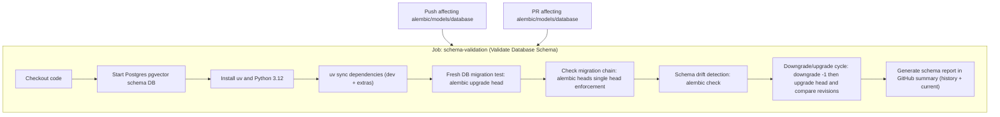

# Schema Validation - Flow Diagram

Flow diagram for Schema Validation workflow.

```mermaid
flowchart TD
  TriggerPush["Push affecting alembic/models/database"] --> SchemaJob
  TriggerPR["PR affecting alembic/models/database"] --> SchemaJob

  subgraph SchemaJob["Job: schema-validation (Validate Database Schema)"]
    S1["Checkout code"] --> S2["Start Postgres pgvector schema DB"]
    S2 --> S3["Install uv and Python 3.12"]
    S3 --> S4["uv sync dependencies (dev + extras)"]

    S4 --> S5["Fresh DB migration test: alembic upgrade head"]
    S5 --> S6["Check migration chain: alembic heads single head enforcement"]
    S6 --> S7["Schema drift detection: alembic check"]
    S7 --> S8["Downgrade/upgrade cycle: downgrade -1 then upgrade head and compare revisions"]
    S8 --> S9["Generate schema report in GitHub summary (history + current)"]
  end
```

## Related Files

- `.github/workflows/schema-validation.yml`
